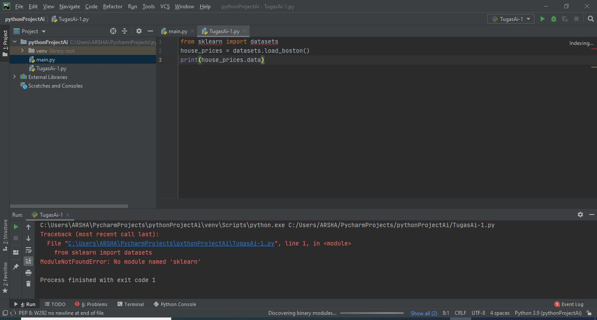
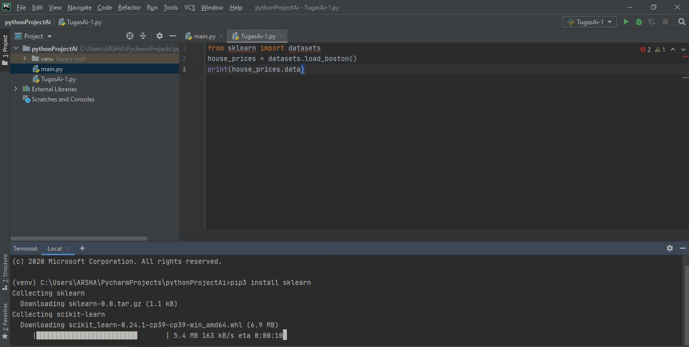
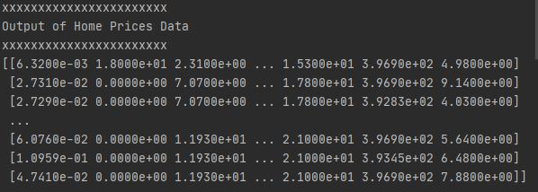
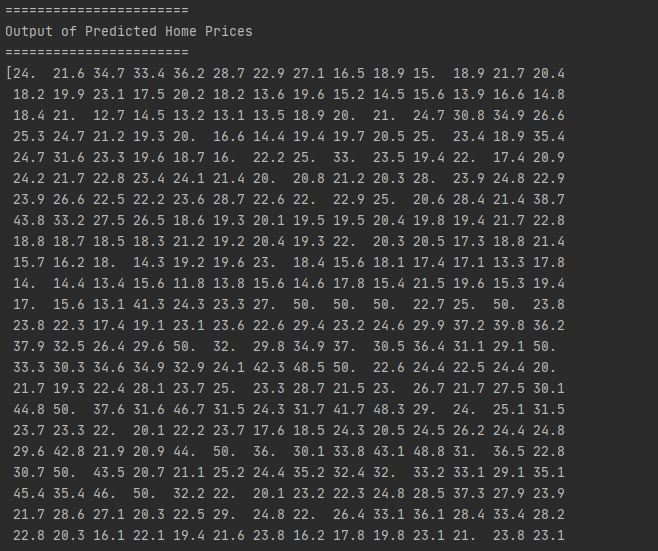
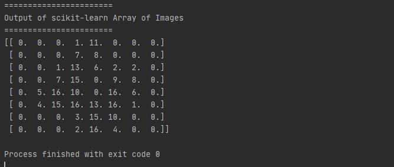

# TugasAi-1
Tugas Latihan Ai-1 (ALDHIAS RIZKY JANUAR)

Before running this script, please install sklearn packages first using this command :

pip3 install sklearn

## Before install sklearn (error)

## Process install sklearn

## Result Output of Home Prices Data

## Output of Predicted Home Prices

## Output of scikit-learn Array of Images

